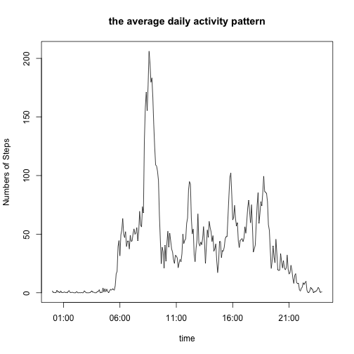

## Loading and preprocessing the data

```r
# language setting
Sys.setlocale("LC_TIME", "en_US.UTF-8")
```

```
## [1] "en_US.UTF-8"
```

```r
library(lubridate)
library(ggplot2)
library(knitr)
raw.data <- read.csv("activity.csv")
raw.data$date <- as.Date(raw.data$date, format = "%Y-%m-%d")
# then convert the "interval" variable to the kinds of time stamp
# also make new variables indicating time
raw.data$time <- sprintf("%04d", raw.data$interval)
temp <- format(strptime(raw.data$time, format="%H%M"), format = "%H:%M")
raw.data$time <- temp
temp <- paste(raw.data$date, raw.data$time)
raw.data$fullTime <- strptime(temp, "%Y-%m-%d %H:%M")
```
## What is mean total number of steps taken per day?
NA can be ignored in this part

```r
NAomit.data <- na.omit(raw.data)
# calculate total number of steps each day
steps.each.day <- tapply(NAomit.data$steps,NAomit.data$date, sum)
```
draw the histogram here

```r
hist(steps.each.day, xlab = " total number of steps taken each day", main = "Histogram of total number of steps taken each day", breaks=20)
```

 

calculate the mean total number of steps taken per day

```r
# calculate mean
mean.steps <- mean(steps.each.day)
print(mean.steps)
```

[1] 10766.19

calculate the mean total number of steps taken per day

```r
# calculate median
median.steps <- median(steps.each.day)
print(median.steps)
```

[1] 10765

## What is the average daily activity pattern?
* Make a time series plot (i.e. type = "l") of the 5-minute interval (x-axis) and the average number of steps taken, averaged across all days (y-axis)


```r
# calculate the average number of steps taken, averaged across all days
average.daily.patten <- tapply(NAomit.data$steps,NAomit.data$time, mean)
# extract the labels indicating time
xlabs <- row.names(average.daily.patten)
# convert to time stamp
temp <- strptime(xlabs, format="%H:%M")
# draw figure
xlabs <- temp
plot(x = xlabs,
     y = average.daily.patten,
     type = "l",
     main = "the average daily activity pattern",
     xlab = "time",
     ylab = "Numbers of Steps")
```

 

* Which 5-minute interval, on average across all the days in the dataset, contains the maximum number of steps?


```r
max(average.daily.patten)
```

[1] 206.1698

```r
which.max(average.daily.patten)
```

08:35 
  104 

* the 8:35 interval contains the maximum number of steps, which is 206.1698 steps on average

## Imputing missing values

1. Calculate and report the total number of missing values in the dataset (i.e. the total number of rows with NAs)


```r
total.na.number <- sum(is.na(raw.data))
total.na.number
```

[1] 2304

* the total number of missing values is 2304

2. Devise a strategy for filling in all of the missing values in the dataset. The strategy does not need to be sophisticated. For example, you could use the mean/median for that day, or the mean for that 5-minute interval, etc.

3. Create a new dataset that is equal to the original dataset but with the missing data filled in.

* replace NAs with the mean for that interval across all days and create the new dataset


```r
# replace NAs with the mean for that interval across all days
# create new dataset for filling NAs
NAfilled.data <- raw.data
for (i in 1: nrow(NAfilled.data)){
        if (is.na(NAfilled.data$steps[i])){
                fInd <- i %% 288 
                if (fInd != 0) {
                        NAfilled.data[i,1] <- average.daily.patten[fInd]
                } else {
                        NAfilled.data[i,1] <- average.daily.patten[288]
                }
        }
}
```

4. Make a histogram of the total number of steps taken each day and Calculate and report the mean and median total number of steps taken per day. Do these values differ from the estimates from the first part of the assignment? What is the impact of imputing missing data on the estimates of the total daily number of steps?


```r
# calculate total number of steps each day
steps.each.day2 <- tapply(NAfilled.data$steps,NAfilled.data$date, sum)
hist(steps.each.day2, xlab = " total number of steps taken each day", main = "Histogram of total number of steps taken each day with new data", breaks=20)
```

 

```r
# calculate mean and median
mean.steps2 <- mean(steps.each.day2)
median.steps2 <- median(steps.each.day2)
mean.steps2
```

[1] 10766.19

```r
median.steps2
```

[1] 10766.19

The mean and the median are both 10766.19 now. After filling the NAs, the pattern of the histograms becomes more concertrating toward the center.

## Are there differences in activity patterns between weekdays and weekends?


```r
#create new varibles in the dataset with filled NAs
weekdays1 <- c('Monday', 'Tuesday', 'Wednesday', 'Thursday', 'Friday')
NAfilled.data$week.day <- 
        factor((weekdays(NAfilled.data$fullTime) %in% weekdays1),
        levels = c(FALSE,TRUE),
        labels = c("weekend","weekday"))
# calaute activity pattern in the weekday days
# get subset data of weekdays
weekday.data <- subset(NAfilled.data, NAfilled.data$week.day=="weekday")
# calculate activity pattern in the weekdays
weekday.patten <- tapply(weekday.data$steps,weekday.data$time, mean)
# get subset data of weekdays
weekend.data <- subset(NAfilled.data, NAfilled.data$week.day=="weekend")
# get activity pattern in the weekend
weekend.patten <- tapply(weekend.data$steps,weekend.data$time, mean)

# make panel plot
xlabs <- strptime(row.names(weekday.patten), format('%H:%M'))
par(mfrow=c(2,1))
plot(x=xlabs, y=weekday.patten,type = "l", main = "weekdays", xlab = "time", ylab = "steps",ylim=c(0,250))

plot(x=xlabs, y=weekend.patten,type = "l", main = "weekend", xlab = "time", ylab = "steps",ylim=c(0,250))
```

 

* the patterns are different, the anonymous had more activites in the afternoon in the weekend compared to the weekdays
